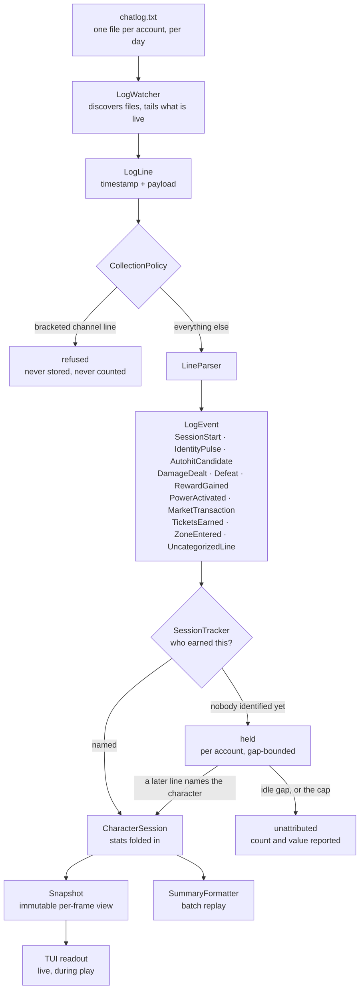

# How a chat log becomes a session

What the game writes, what this tool reads, what it refuses, and how a line of
text ends up as a number on screen. The [PRD](PRD.md) says what the product is;
this says how the engine gets there.

The tool **only ever reads**. It never writes to the game directory, and
communication channels are never collected — see
[what is refused](#what-is-refused) below.

## The flow through



Every stage is pure except the first: given the same bytes, the same numbers
come out. That is what makes a replay of yesterday's logs reproduce yesterday's
session exactly, and what lets a metric added in a later version be computed
retroactively over logs already on disk.

## What the game writes

Homecoming writes one chat log per account per day:

```text
<install>/accounts/<account>/Logs/chatlog 2026-09-02.txt
```

Each line is a local timestamp followed by a payload. Lines the game routes
through a named chat channel carry the channel in brackets; everything else —
combat, rewards, defeats, market, zone changes — is written bare.

**Chat logging is a per-character setting, not a per-account one.** This is the
single most consequential fact about the source data. Switching characters on an
account that has logging enabled lands you on a character that does not, and the
game says nothing about it. The box silently stops contributing, and the totals
stay plausible while being a fraction of reality — it happened three times in one
evening of testing before the readout learned to say so. See
[the client warning](#when-a-box-goes-quiet).

## What is refused

Bracketed channel lines are recognised and **discarded at the parser boundary**,
before anything is stored. The allowlist is empty and has no mechanism to add to
it: refusal is structural, not a filter someone has to remember to apply.

There is no use case that justifies breaking a player's trust by collecting what
other people typed. This is not configurable.

## What is collected

Everything else is parsed into a typed event and tagged with a category:

| Category | Events | What it feeds |
| --- | --- | --- |
| `Session` | `SessionStart` | Session boundaries |
| `Identity` | `IdentityPulse`, `AutohitCandidate` | Who earned it |
| `Damage` | `DamageDealt` | Damage totals and rates |
| `Defeat` | `Defeat` | Defeat counts and rates |
| `Reward` | `RewardGained`, `TicketsEarned` | XP, influence, tickets |
| `PowerActivation` | `PowerActivated` | Activation counts |
| `Market` | `MarketTransaction` | Income and spend |
| `Zone` | `ZoneEntered` | Location context |
| `Uncategorized` | `UncategorizedLine` | Counted, not interpreted |

## Who earned it

A log file belongs to an *account*. The statistics belong to a *character*. The
line that connects them is not always there, so the tracker uses three signals,
in descending order of certainty:

1. **The login banner** — `Welcome to City of Heroes, <name>!`. The one line no
   enemy, pet or other player can produce. Definitive.
2. **A self-only inherent autohit** — `HIT <name>! Your Health power is
   autohit.` Every character has Health and Stamina, and they affect nobody
   else, so the name can only be the player's own. Definitive without
   corroboration, which is what identifies a character whose first logged
   session has no banner.
3. **A corroborated autohit** — any other autohit naming someone already seen in
   a banner *on this account*. The roster is the filter.

An uncorroborated autohit naming anyone else is **evidence of nothing**. Powers
name whoever they land on, not who cast them: a single vicinity buff named 778
distinct people across one account's history, and one Judgement power named the
enemies it hit 308 times. Believing those names would open sessions called after
enemy mobs.

Rosters are per account, so one box cannot name another — a real case, because
the operator's own boxes buff each other constantly.

### Lines that arrive before anyone is named

Enabling logging mid-session leaves no banner, so the first minutes of a farm can
arrive with nobody identified. Those events are **held** per account rather than
discarded:

- A later line that names the character **adopts** the held events, and the
  session starts at the first held line rather than at the moment of
  identification.
- A **login banner does not adopt** them. A banner announces an arrival, so
  whatever preceded it belongs to whoever was playing before.
- Holding is bounded four ways: an idle gap (30 minutes, the same window that
  closes a session) discards what precedes it, whether the gap falls between
  two held lines or between the last held line and the one that finally names
  somebody; a proven client exit discards them outright, being stronger
  evidence than silence; a login banner discards them, as above; and a hard cap
  discards oldest-first so a log that never identifies anyone cannot grow
  without limit.

Whatever is never claimed is reported as **unattributed**, with its value:

```text
sessions 9 | unattributed lines 586
  unattributed value: xp 1864215 | inf 3424108 (no character was identified when these arrived)
```

A bare count could not distinguish login chatter from a fifth of a farm. Both
read as "unattributed", and 1,864,215 XP once hid there.

## Attaching to a live log

The watcher rediscovers files periodically and attaches to any whose last write
falls inside a 30-minute window. Older files are ignored: a directory holding
months of logs would otherwise replay all of it at launch, which is exactly the
62-second silent freeze that made the v0.5.0 binary look broken.

### When a box goes quiet

Because logging is per character, the readout compares **running game clients**
against **accounts being read**, and says so when clients outnumber logs:

```text
!! 3 clients, 2 logging - enable Log Chat
```

It leads the status line, so a long accounts path clips before the advice does.
It is silent when the counts agree, and silent when the client count cannot be
determined.

"Accounts being read" means accounts *currently writing lines* — judged by the
same 30-minute window that decides which files to pick up. Counting attached
files instead made this useless for the case it exists for: nothing detaches a
file for going quiet, so the count never fell and a live character switch went
unremarked.

Two consequences worth knowing:

- A mismatch has to hold for about a minute before it is shown. A client at the
  login or character-select screen genuinely has no log yet, and a warning that
  fires on every launch is a warning you learn to ignore.
- A box that goes quiet is noticed once the window elapses, not instantly.
  Silence is the only evidence available — the game never announces that
  logging was turned off.

## Getting the most out of the logs

Chat logging is configured in-game per character, and the channels routed to a
logged tab decide what the tool can see. A dedicated **data-only tab** — no
communication channels at all — gives the engine everything it can use and
nothing it would refuse:

| | |
| --- | --- |
| **Combat** | Damage Inflicted, Damage Received, Hit Rolls, General Combat, Combat Warnings, Healing Delivered, Healing Received |
| **Pets** | Pet Damage Inflicted, Pet Damage Received, Pet Hit Rolls, Pet Combat, Pet Healing Delivered, Pet Healing Received, Pets |
| **Rewards** | Rewards, Consignment House |
| **Context** | Architect Entertainment, NPC Dialog, Cutscene Captions, Event Messages, Error, System |

Twenty-two channels, no chat. Measured against a general tab, this raised the
number of distinct line shapes reaching the parser from 95 to 197 — 131 of them
new — chiefly per-power damage attribution and pet contribution, which are what
CP2's metrics are built from.

`General` and `Request/Auction` are deliberately absent: both carry player-typed
text, which the parser would refuse anyway.

## What the logs cannot tell you

Worth knowing before trusting a number that looks low:

- **Teammate damage is never logged.** The game does not write it, at any
  distance. A team's damage total is your own, plus your pets.
- **Teammate defeats are only partly observable** — 61–73% in measured sessions,
  depending on how spread out the team was.
- **Detailed damage requires proximity.** When characters are far apart the game
  stops writing the per-hit detail, so a distant box's contribution reads lower
  than it was.

These are properties of the source data, not of the parser. Nothing in the tool
can recover them; the numbers are honest about what the game chose to write.
