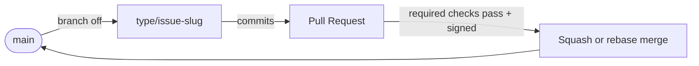
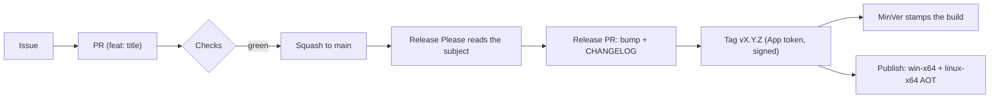
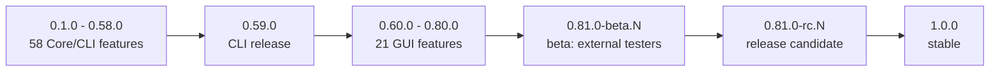

# Branch and release strategy

How paragon-stats turns work into versioned releases. Trunk-based development plus
Conventional Commits drive the version; [Release Please](https://github.com/googleapis/release-please)
computes it and tags; [MinVer](https://github.com/adamralph/minver) stamps the binary. The
version is a map of **features to releases**.

## Branching

Trunk-based: one protected `main`, short-lived branches, squash or rebase merges (no merge
commits).

- Branch name `<type>/<issue#>-<short-kebab-summary>` (e.g. `feat/42-experience-rate`),
  enforced by the `branch-name` check. See [commits.md](style-guides/commits.md).
- One PR per issue, targeting `main`; all required checks must pass before merge.

## Versioning

The version is **driven by commit type**, not chosen by hand. Because PRs squash-merge and
the repo's squash subject is the **PR title**, the PR title must be a Conventional Commit --
that line is what Release Please parses (guarded by the `semantic-pr` check; `commitlint`
separately lints the branch commits).

| Commit / PR title | Effect (pre-1.0) |
| --- | --- |
| `feat:` | minor (`0.4.0` to `0.5.0`) |
| `fix:` | patch (`0.5.0` to `0.5.1`) |
| `feat!:` / `BREAKING CHANGE:` | minor (kept in `0.x`) |
| `chore:` `ci:` `docs:` `refactor:` `test:` `perf:` `style:` `build:` | no release |

One feature = one `feat:` PR = one minor. Deliberate "ship everything so far" releases (the
CLI cut, betas, RCs, `1.0.0`) carry no new feature and are cut with a `Release-As: x.y.z`
footer.

## The ladder (features to releases)

| Range | Stage | How it's cut |
| --- | --- | --- |
| `0.1.0` - `0.58.0` | 58 Core/CLI features | one `feat:` PR per feature, minor |
| `0.59.0` | Core/CLI release | `Release-As: 0.59.0`; full regression + string tests |
| `0.60.0` - `0.80.0` | 21 GUI features | one `feat:` PR per feature, minor |
| `0.81.0-beta.N` | Beta | `Release-As:`; external testers; re-packages bump `-beta.(N+1)` |
| `0.81.0-rc.N` | Release candidate | `Release-As:`; feedback-driven fixes |
| `1.0.0` | Stable | `Release-As: 1.0.0`; frozen format; signed AOT |

Pre-1.0 the minor number is a **feature odometer, not a compatibility contract** -- per
[SemVer](https://semver.org/) major-zero, anything may change until `1.0.0`. The feature
inventory is in [FEATURE-MAP.md](../plans/FEATURE-MAP.md).

## Pipeline tools

- **Conventional Commits** drive the bump: `commitlint` lints the branch commits,
  `semantic-pr` lints the PR title that becomes the squash subject.
- **Release Please** parses the merged subject, opens a release PR, tags `vX.Y.Z`, and writes
  the CHANGELOG. It runs under a GitHub App token so its commits are signed (satisfying the
  required-signatures ruleset) and its release PR's required checks actually run.
- **MinVer** stamps `AssemblyVersion` / `FileVersion` / the AOT version from the tag
  (`MinVerTagPrefix=v`); between tags it auto-increments the next minor.
- **Release artifacts**: native AOT binaries (`win-x64`, `linux-x64`) are built per-RID and
  attached to the GitHub Release.

## Release tags

Release Please owns the `vX.Y.Z` tag namespace -- **humans never hand-cut version tags.**
Each `feat:` / `fix:` merge lets it tag the next version, which MinVer reads verbatim to
stamp the build.

- **No pre-product marker tags.** The repo carries one hand-made annotated anchor, `v0.0.0`
  (baseline; anchors Release Please + MinVer at 0.x). There is no `v0.0.1` "repo ready" tag:
  [SemVer](https://semver.org/) starts initial development at `0.1.0`, and a manual marker
  would only skew MinVer's in-development versions (it bases the next version on the nearest
  tag) for no product benefit. Repo-readiness is a milestone state, not a git ref.
- **Hand-made tags are annotated and SSH-signed** (`git tag -s`), matching the signed-commit
  posture -- reserved for non-version anchors like `v0.0.0`.
- **A bare git tag, not a GitHub Release**, for anything without build artifacts. GitHub
  Releases are for shipped binaries; the win-x64 / linux-x64 AOT publish attaches to the real
  `vX.Y.Z` releases Release Please cuts.
